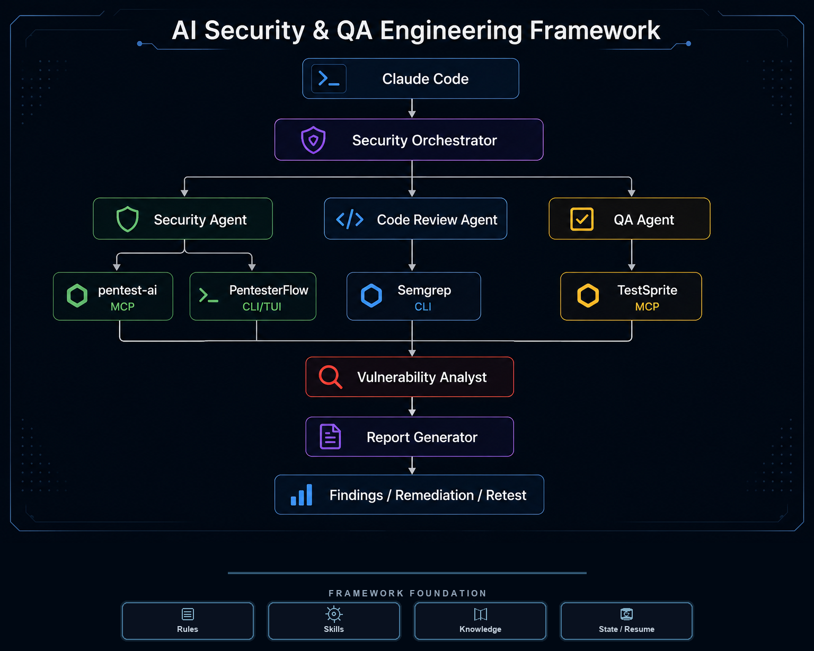

# AI Security & QA Engineering Framework

> AI-powered orchestration for security testing, code review, QA, vulnerability analysis, and reporting.

<p align="center">
  
</p>

<p align="center">
  <strong>Framework Foundation</strong>
</p>

<p align="center">
  <a href="./.claude/rules/" style="display:inline-block;background:#1a1a2e;color:#e8e8f0;padding:6px 14px;border-radius:20px;border:1px solid #3a3a5c;font-family:system-ui,-apple-system,sans-serif;font-size:13px;font-weight:600;margin:0 6px;box-shadow:0 2px 8px rgba(0,0,0,0.3);text-decoration:none;">⚖ Rules</a>
  <a href="./.claude/skills/" style="display:inline-block;background:#1a1a2e;color:#e8e8f0;padding:6px 14px;border-radius:20px;border:1px solid #3a3a5c;font-family:system-ui,-apple-system,sans-serif;font-size:13px;font-weight:600;margin:0 6px;box-shadow:0 2px 8px rgba(0,0,0,0.3);text-decoration:none;">⚙ Skills</a>
  <a href="./.claude/knowledge/" style="display:inline-block;background:#1a1a2e;color:#e8e8f0;padding:6px 14px;border-radius:20px;border:1px solid #3a3a5c;font-family:system-ui,-apple-system,sans-serif;font-size:13px;font-weight:600;margin:0 6px;box-shadow:0 2px 8px rgba(0,0,0,0.3);text-decoration:none;">📚 Knowledge</a>
  <a href="./.claude/state/" style="display:inline-block;background:#1a1a2e;color:#e8e8f0;padding:6px 14px;border-radius:20px;border:1px solid #3a3a5c;font-family:system-ui,-apple-system,sans-serif;font-size:13px;font-weight:600;margin:0 6px;box-shadow:0 2px 8px rgba(0,0,0,0.3);text-decoration:none;">↻ State / Resume</a>
</p>

An open-source Claude Code framework for coordinated software analysis, authorized security assessment, functional QA, evidence validation, and professional reporting.

## What It Solves

Security and QA work often produces disconnected scanner alerts, test results, and code-review notes. This framework coordinates specialized agents and capabilities so work follows a consistent lifecycle:

1. Scope and authorization
2. Target and architecture discovery
3. Evidence-driven execution
4. Triage and correlation
5. Vulnerability validation
6. Severity and confidence classification
7. Reporting and, when required, retesting

The framework does not treat tool output alone as a confirmed vulnerability.

## Architecture

```text
Claude Code
    |
    v
Security Orchestrator
    |
    +--> Code Review Agent --> Semgrep (CLI)
    |
    +--> Security Agent --> pentest-ai (MCP)
    |                     PentesterFlow (CLI/TUI)
    |
    +--> QA Agent --> TestSprite (MCP)
                          |
                          v
                 Shared Evidence
                          |
                          v
                 Vulnerability Analyst
                          |
                          v
                 Report Generator
```

Tool availability depends on the user's Claude Code environment, installation, credentials, and configuration. Verify every capability before use. This project does not claim unverified headless execution.

## Agents

- **Security Orchestrator** — defines scope, objectives, strategy, dependencies, and execution order.
- **Security Agent** — performs authorized reconnaissance and dynamic security testing.
- **Code Review Agent** — performs source-level security analysis and secure coding review.
- **QA Agent** — performs functional, API, integration, regression, and end-to-end testing.
- **Vulnerability Analyst** — correlates evidence, removes duplicates, validates findings, and assesses severity, confidence, and impact.
- **Report Generator** — turns validated results into structured, evidence-based reports.

## Skills

Reusable domain workflows live under `.claude/skills/`:

- `.claude/skills/security-audit/` — authorized security assessment workflow
- `.claude/skills/code-review/` — source-code security review
- `.claude/skills/qa-testing/` — functional and regression testing
- `.claude/skills/reporting/` — validated finding reporting

## Rules

Operational policy lives under `.claude/rules/`:

- `workflow.md` — lifecycle, ordering, dependencies, checkpoints, and recovery
- `tool-selection.md` — objective- and evidence-based capability selection
- `severity-model.md` — severity, confidence, exploitability, impact, and evidence model

## Knowledge

Reference material lives under `.claude/knowledge/`:

- `security-patterns.md`
- `common-vulnerabilities.md`
- `testing-strategy.md`

Knowledge supports planning and analysis; it does not replace evidence.

## State, Checkpoints, and Resume

Persistent workflow state lives under `.claude/state/`. The public repository includes:

- `.claude/state/engagement-state.json` — sanitized empty/template state
- `.claude/state/README.md` — state and recovery guidance
- `.claude/schemas/engagement-state.schema.json` — state schema

The orchestrator records tasks, tool executions, findings, checkpoints, and recovery information. An interrupted task must not be treated as completed. Real engagement targets, credentials, evidence, and findings must remain private.

## Behavior Profiles

Behavior guidance is separated from framework rules:

- `.claude/profiles/claude-fable-style.md` — response and reasoning style
- `.claude/profiles/claude-fable-style-safety.md` — public safety and behavioral guardrails

Do not place private system prompts, credentials, or engagement data in either profile.

## Tool Integrations

| Agent | Capability | Integration |
| --- | --- | --- |
| Security Agent | `pentest-ai` | MCP capability |
| Security Agent | `PentesterFlow` | CLI/TUI |
| Code Review Agent | `Semgrep` | CLI |
| QA Agent | `TestSprite` | MCP capability |

`pentest-ai` and TestSprite require appropriate Claude Code MCP configuration. Semgrep requires a local CLI installation. PentesterFlow requires its CLI/TUI installation. Installation and availability are environment-specific.

## Prerequisites

- Claude Code with access to this repository
- Authorization and explicit scope for any active security testing
- MCP configuration for `pentest-ai` or TestSprite when those capabilities are in scope
- Semgrep CLI when static analysis is in scope
- PentesterFlow CLI/TUI when broader penetration-testing workflow is in scope
- Appropriate test accounts and synthetic data when needed

## Setup

1. Clone the repository.
2. Open the repository in Claude Code.
3. Review `.claude/CLAUDE.md`, relevant agents, skills, rules, and safety guidance.
4. Configure only the capabilities needed for your objective.
5. Verify tool availability and credentials in your own environment.
6. Keep local configuration and engagement data outside version control.

Example repository paths:

```text
.claude/agents/
.claude/skills/
.claude/rules/
.claude/knowledge/
.claude/state/
.claude/schemas/
.claude/profiles/
```

Do not copy machine-specific paths into project documentation.

## Claude Code Usage

Use Claude Code from the repository root and state a clear objective, target, scope, environment, constraints, and required output. The orchestrator selects the smallest suitable capability set. For example:

- Source-only review: Code Review Agent and Semgrep CLI
- Authorized runtime security test: Security Agent with pentest-ai or PentesterFlow
- Functional workflow validation: QA Agent with TestSprite
- Full assessment: combine complementary capabilities, then correlate and validate evidence

No active security testing should begin until authorization and scope are explicit.

## First Run

For a first run:

1. Confirm the target and authorization boundaries.
2. Identify whether source code, runtime, API, and test accounts are available.
3. Choose the relevant skill and review its agent/tool contract.
4. Verify selected capabilities.
5. Run a narrow, non-destructive assessment.
6. Review evidence, limitations, and persisted state before expanding work.

## Limitations and Safety

- This framework coordinates capabilities; it does not install or guarantee them.
- MCP servers, CLIs, credentials, and target environments may be unavailable.
- Static analysis identifies candidates and does not automatically prove exploitability.
- QA results do not automatically establish a security vulnerability.
- Dynamic security testing requires authorization and must remain in scope.
- Production testing must be low-impact, rate-limited, non-destructive, and monitoring-aware.
- Do not access unrelated systems, exfiltrate real data, delete data, cause denial of service, or test discovered assets without authorization.
- Record tool failures and coverage limitations honestly.

See [SECURITY.md](SECURITY.md) for security requirements and responsible disclosure guidance.

## Contributing

See [CONTRIBUTING.md](CONTRIBUTING.md). Contributions must preserve authorization-first behavior, evidence integrity, security/QA separation, schema compatibility, and documented capability boundaries.

## License

MIT License. See [LICENSE](LICENSE).

## Status

Preview release: `v0.1.0`
